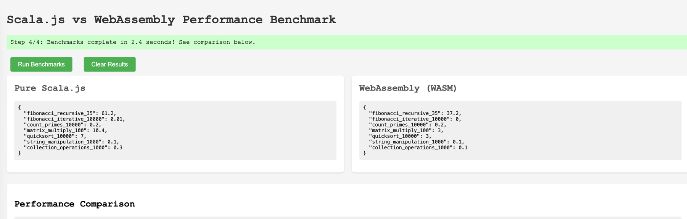

# play-scalajs

A Play Framework application with Scala.js frontend and WebAssembly support, featuring performance benchmarking between pure JavaScript and WebAssembly compilation targets.

## Features

- **Play Framework Backend**: Scala-based server application
- **Scala.js Frontend**: Write frontend code in Scala, compile to JavaScript
- **WebAssembly Support**: Experimental WASM compilation for performance-critical code
- **Performance Benchmarking**: Compare JS vs WASM performance across various computational tasks
- **Shared Code**: Common code between server and client via cross-compilation

## Project Structure

```
├── server/          # Play Framework backend
├── client/          # Main Scala.js frontend application
├── shared/          # Code shared between JVM and JS platforms
├── benchmark-common/# Shared benchmarking code
├── benchmark-js/    # Pure JavaScript benchmark module
├── benchmark-wasm/  # WebAssembly benchmark module
└── build.sbt        # SBT build configuration
```

## Prerequisites

- JDK 17+
- SBT 1.9+
- Node.js (for WASM support)

## Getting Started

### Run the Application

```bash
sbt run
```

Navigate to `http://localhost:9000` to see the application.

### Run Benchmarks

1. Start the server:
   ```bash
   sbt run
   ```

2. Navigate to `http://localhost:9000/benchmark`

3. Click "Run Benchmarks" to compare JS vs WASM performance

## Development

### Compile Frontend Assets

```bash
# Compile client Scala.js code
sbt client/fastLinkJS

# Compile benchmark modules
sbt benchmarkJS/fastLinkJS
sbt benchmarkWasm/fastLinkJS
```

### Continuous Compilation

```bash
# Watch for changes and recompile
sbt ~client/fastLinkJS
```

## Benchmark Suite



The benchmark compares performance across:

- **Fibonacci** (recursive and iterative implementations)
- **Prime Number Counting** (up to 10,000)
- **Matrix Multiplication** (100x100 matrices)
- **QuickSort** (10,000 elements)
- **String Manipulation** (1,000 iterations)
- **Collection Operations** (filter, map, flatMap, reduce)

### Expected Results

- **WebAssembly** typically excels at:
  - CPU-intensive numeric computations
  - Tight loops with predictable patterns
  - Matrix operations and mathematical algorithms

- **Pure JavaScript** may perform better for:
  - String operations (due to WASM-JS boundary overhead)
  - Small tasks where WASM initialization overhead matters
  - Collection operations leveraging JS engine optimizations

## Configuration

### WebAssembly Configuration

The project uses experimental WebAssembly features in `build.sbt`:

```scala
scalaJSLinkerConfig := {
  scalaJSLinkerConfig.value
    .withExperimentalUseWebAssembly(true)
    .withModuleKind(ModuleKind.ESModule)
}
```

### Node.js Environment

For WASM execution, Node.js requires specific flags:

```scala
jsEnv := {
  val config = NodeJSEnv.Config()
    .withArgs(List(
      "--experimental-wasm-exnref",
      "--experimental-wasm-imported-strings",
      "--turboshaft-wasm"
    ))
  new NodeJSEnv(config)
}
```

## Troubleshooting

### Module Import Errors

If you see "Cannot use import statement outside a module", ensure scripts are loaded with `type="module"`:

```html
<script type="module" src="/assets/main.js"></script>
```

### WASM Loading Issues

Check browser console for detailed error messages. Modern browsers with WASM support are required.

### Port Already in Use

If port 9000 is already in use:

```bash
# Find and kill the process using port 9000
lsof -i :9000
kill -9 <PID>
```

## License

This project is for demonstration and educational purposes.
